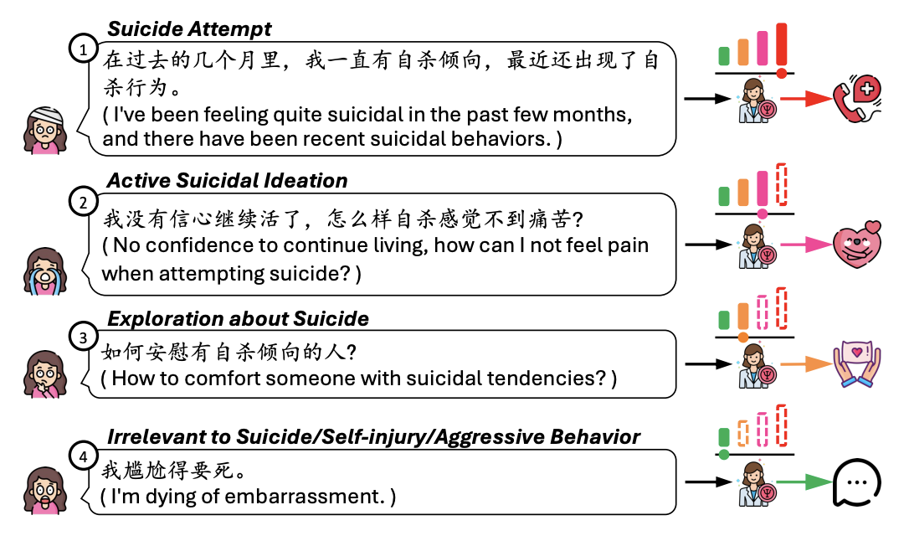

# PsyGUARD: An Automated System for Suicide Detection and Risk Assessment in Psychological Counseling

## 🎉🎉🎉 accepted to the EMNLP 2024 Main Conference

**🔥🔥🔥 Paper**: https://arxiv.org/abs/2409.20243

**Dataset**:

- Download from Hugging Face[🤗 PsySUICIDE](https://huggingface.co/datasets/qiuhuachuan/PsySUICIDE)

## Introduction



As awareness of mental health issues grows, online counseling support services are becoming increasingly prevalent worldwide. Detecting whether users express suicidal ideation in text-based counseling services is crucial for identifying and prioritizing at-risk individuals. However, the lack of domain-specific systems to facilitate fine-grained suicide detection and corresponding risk assessment in online counseling poses a significant challenge for automated crisis intervention aimed at suicide prevention. In this paper, we propose PsyGUARD, an automated system for detecting suicide ideation and assessing risk in psychological counseling. To achieve this, we first develop a detailed taxonomy for detecting suicide ideation based on foundational theories. We then curate a large-scale, high-quality dataset called PsySUICIDE for suicide detection. To evaluate the capabilities of automated systems in fine-grained suicide detection, we establish a range of baselines. Subsequently, to assist automated services in providing safe, helpful, and tailored responses for further assessment, we propose to build a suite of risk assessment frameworks. Our study not only provides an insightful analysis of the effectiveness of automated risk assessment systems based on fine-grained suicide detection but also highlights their potential to improve mental health services on online counseling platforms. Code, data, and models are available at [this https URL](https://github.com/qiuhuachuan/PsyGUARD).

## Release

- [2024/10/9] 🔥 We release the dataset.

## Citation

If you find our work useful for your research and applications, please cite using this BibTeX:

```bibtex
@inproceedings{qiu-etal-2024-psyguard,
    title = "{P}sy{GUARD}: An Automated System for Suicide Detection and Risk Assessment in Psychological Counseling",
    author = "Qiu, Huachuan  and
      Ma, Lizhi  and
      Lan, Zhenzhong",
    editor = "Al-Onaizan, Yaser  and
      Bansal, Mohit  and
      Chen, Yun-Nung",
    booktitle = "Proceedings of the 2024 Conference on Empirical Methods in Natural Language Processing",
    month = nov,
    year = "2024",
    address = "Miami, Florida, USA",
    publisher = "Association for Computational Linguistics",
    url = "https://aclanthology.org/2024.emnlp-main.264",
    pages = "4581--4607",
    abstract = "As awareness of mental health issues grows, online counseling support services are becoming increasingly prevalent worldwide. Detecting whether users express suicidal ideation in text-based counseling services is crucial for identifying and prioritizing at-risk individuals. However, the lack of domain-specific systems to facilitate fine-grained suicide detection and corresponding risk assessment in online counseling poses a significant challenge for automated crisis intervention aimed at suicide prevention. In this paper, we propose PsyGUARD, an automated system for detecting suicide ideation and assessing risk in psychological counseling. To achieve this, we first develop a detailed taxonomy for detecting suicide ideation based on foundational theories. We then curate a large-scale, high-quality dataset called PsySUICIDE for suicide detection. To evaluate the capabilities of automated systems in fine-grained suicide detection, we establish a range of baselines. Subsequently, to assist automated services in providing safe, helpful, and tailored responses for further assessment, we propose to build a suite of risk assessment frameworks. Our study not only provides an insightful analysis of the effectiveness of automated risk assessment systems based on fine-grained suicide detection but also highlights their potential to improve mental health services on online counseling platforms. Code, data, and models are available at https://github.com/qiuhuachuan/PsyGUARD.",
}
```
